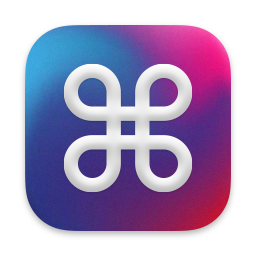

# Anykey

> Disclaimer: Anykey is free, open-source software. I maintain it in my spare time. Use at your own risk.

A free macOS app for binding shell commands to system-wide or app-specific hotkeys. It’s configured via a text file that can be stored in Git or synced to Dropbox.


For the curious: [Read the story behind Anykey](https://temochka.com/blog/posts/2021/02/26/anykey.html) on my personal blog.

## Who is it for?

Primarily, macOS automation enthusiasts like myself who wish to store their hotkey configuration in Git or generate it programmatically. All existing alternatives (that I’m aware of) make this impossible or very difficult.
Karabiner-Elements comes pretty close though (here’s an [example config](https://gist.github.com/temochka/e2a765eed2175baad6d774471fc27e3e)).

| App                                | Text config | App-specific hotkeys | Auto-reload | Free | Open Source |
|------------------------------------|-------------|----------------------|-------------|------|-------------|
| ⌘ Anykey                           |      ✅     |     ✅                |     ✅      |  ✅  |      ✅      |
| [Automator + System preferences][] |      ❌     |     ✅                |     ❌      |  ✅  |      ❌      |
| [Alfred Powerpack][]               |      ❌     |     ✅                |     ❌      |  ❌  |      ❌      |
| [Karabiner-Elements][]             |      ✅     |     ✅                |     ❌      |  ✅  |      ✅      |
| [Keyboard Maestro][]               |      ❌     |     ✅                |     ❌      |  ❌  |      ❌      |
| [Hammerspoon][]                    |      ✅     |     ❌                |     ❌      |  ✅  |      ✅      |

[Automator + System preferences]: https://appleinsider.com/articles/18/03/14/how-to-create-keyboard-shortcuts-to-launch-apps-in-macos-using-automator
[Alfred Powerpack]: https://www.alfredapp.com/workflows/
[Keyboard Maestro]: https://www.keyboardmaestro.com/main/
[Hammerspoon]: http://www.hammerspoon.org
[Karabiner-Elements]: https://karabiner-elements.pqrs.org

## Installation

Requires macOS 10.15 Catalina or later, optimized for macOS 11 Big Sur.

* Download the [latest release](https://github.com/temochka/Anykey/releases/latest) from GitHub.
* Unzip and copy the app to your Applications folder.
* Launch the app (which macOS will refuse, because I’m not a “verified developer”).
* Go to “Security & Privacy 〉General” in System Preferences and manually allow the blocked app.
* Launch Anykey again. It’ll ask for Accessibility permissions, follow the link in the prompt to enable.
* Launch Anykey one more time, then press <kbd>⌘</kbd>+<kbd>⌥</kbd>+<kbd>⌃</kbd>+<kbd>⇧</kbd>+<kbd>A</kbd>. You should hear a greeting (make sure your sound is on). If you enabled notifications, you should see a notification banner pop up.

### Launching on startup

To launch Anykey on startup, add it to your login items (`System Preferences 〉Users & Groups 〉Login Items`).

### Hiding the status bar icon

If you would rather not have Anykey in your status bar, there’s an option to "Hide Anykey from status bar" in Settings. When Anykey is hidden, launch it again to show settings, press the “Quit” button in settings to quit.

## Configuration

By default, Anykey will create a [JSON](https://en.wikipedia.org/wiki/JSON) config at `~/.Anykey.json` if it’s missing. This path can be changed in app preferences. Anykey auto-reloads its configuration whenever the specified file changes on the disk, reporting any errors via macOS notifications.

```json
{
    "hotkeys":
    [ { "title": "Anykey welcome"
      , "displayNotification": true
      , "key": "a"
      , "modifiers": ["⌘", "⇧", "⌥", "⌃"]
      , "shellCommand": "say 'Thank you for using Anykey!'"
      }
    ]
}
```

Recognized top-level (global) settings are:

* `hotkeys` (required) - an array of hotkey definitions (see below)
* `workingDirectory` (optional) - a string path to the directory at which to run shell commands (unless overridden per hotkey), defaults to `"/"`.

The hotkey definition supports the following attributes:

* `title` (required) - a concise description of what the hotkey does. It will be used in triggered notifications;
* `key` (required) - a string describing the symbol part of the desired hotkey (e.g., `o` in <kbd>⌘+o</kbd>);
* `modifiers` (required) — a string array of one or more modifiers (see below) that need to be held for the key to trigger the command;
* `shellCommand` (required) - a string describing the shell command to run when the hotkey is pressed;
* `onlyIn` (optional) - a string array of [bundle IDs](https://developer.apple.com/documentation/appstoreconnectapi/bundle_ids) of apps that this hotkey should only be triggered in.
* `displayNotification` (optional) - a boolean flag determining whether to show a banner notification whenever this command runs, default false.
* `workingDirectory` (optional) - a string path to the directory at which to run the specified shell command, defaults to `"/"`, takes precedence over the global setting.

Here’s a handy command for getting a bundle ID value for any given app:

```bash
mdls -name kMDItemCFBundleIdentifier -r /Applications/Anykey.app
```

### Supported modifiers and their identifiers

* <kbd>⌘</kbd> (Command): `"cmd"`, `"command"`, `"⌘"`;
* <kbd>⌥</kbd> (Option): `"alt"`, `"option"`, `"opt"`, `"⌥"`;
* <kbd>⇧</kbd> (Shift): `"shift"`, `"⇧"`;
* <kbd>⌃</kbd> (Control): `"control"`, `"ctrl"`, `"^"`;
* <kbd>fn</kbd> (Function): `"function"`, `"fn"`.

### Example hotkeys

**Launch an app.** E.g., <kbd>⌥</kbd>+<kbd>⇧</kbd>+<kbd>`</kbd> to launch iTerm2:

```json
{
    "hotkeys":
        [ { "title": "Launch iTerm 2"
          , "key": "`"
          , "modifiers": ["option", "shift"]
          , "shellCommand": "open /Applications/iTerm.app",
          }
        ]
}
```

**Run an AppleScript.** E.g., press <kbd>⌥</kbd>+<kbd>⇧</kbd>+<kbd>=</kbd> to enter "AWS jokes" in Alfred 2:

```json
{
    "hotkeys":
        [ { "title": "Search foo in Alfred"
          , "key": "="
          , "modifiers": ["alt", "shift"]
          , "shellCommand": "osascript -e tell application \"Alfred 4\" to search \"AWS jokes\"",
          }
        ]
}
```

Note: For any non-trivial scripts, consider storing them in separate files (which makes them easier to edit and debug), then run via `osascript filename.scpt` (optionally, use the global `workingDirectory` option to avoid repeating long file paths).

## Acknowledgments

* [Gabriel Theodoropoulos](https://serialcoder.dev/) for writing [“Creating Status Bar Apps on macOS in Swift”](https://www.appcoda.com/macos-status-bar-apps/). Without it, I probably wouldn’t dare to attempt this.
* [Nikita Prokopov](https://tonsky.me) for [AnyBar](https://github.com/tonsky/AnyBar): another minimalist developer-focused tool that can be used for many different things.
* [Sam Soffes](https://github.com/soffes) for the [HotKey](https://github.com/soffes/HotKey) lib for Swift: Anykey doesn’t use HotKey, but borrows some key mapping code from it that would be very tedious to write.
